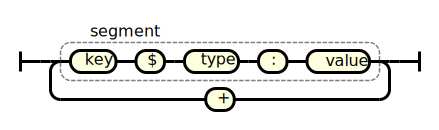

# T-REX

## `T-REX` in a Nutshell

`T-REX` (**T**rivial **R**ecord **Ex**change) is a simple text-based serialization format. It is purpose-built for replacing manual transcription scenarios with easy to implement ad-hoc data transmissions.

Here is an example tare weight (250 mg) and an environmental temperature (293.15 K), formatted using `T-REX`:

```
TARE$MGM:2.5E2+ENV$KEL:293.15
```

`T-REX`-formatted data is typically embedded into a URL by using the extension space of a [`PAC-ID`](https://github.com/ApiniLabs/PAC-ID):

```
HTTPS://PAC.METTORIUS.COM/DEVICE/21:210263/RNR:23*11$T.D:20231121+METHOD$T.A:BASIC
```

This combination results in a globally uniqe identifier referencing the full data record (`PAC-ID`) while also providing directly accessible summarized result data (`T-REX`). Any form of transmission suitable for an URL can be used - in its simplest case this is a QR code.


Other smart building blocks like [PAC-ID Resolver](https://github.com/ApiniLabs/pac-id-resolver) extend the capabilities even further.


## Introduction

`T-REX` is a handy tool designed for quickly sharing simple data results in labs. It's straightforward to use, focusing on ease rather than complexity, and it's a step toward automating how lab devices share data. While it's great for simple transfers like weighing values, it may not handle complex tasks like transferring detailed Chromatography data well. For that, it's better to use [`PAC-ID`](https://github.com/ApiniLabs/PAC-ID), which guides users to the relevant data in their Chromatography Data System (CDS).

Lab equipment can last up to 30 years, but it takes time for standardized interfaces to become widespread. However, many devices can already display QR codes, and updates to their software keep them useful. `T-REX` is designed to work with these devices, bringing immediate digitalization benefits to labs.

Developed from earlier ideas like LabQR and ResultQR by the SiLA 2 Core Working Group, `T-REX` represents the latest innovation in lab data sharing.

## Specification

`T-REX`-formatted data consists of a sequence of ASCII characters, which is made up of individual `segment`s. These `segment`s are separated by `+`.

Each `segment` comprises of a `key`, a `type` and a `value`. `key` and `type` are separated by a `$` colon, while `:` is used as a separator betweren `type` and `value`.

The following diagram shows the main structure of a `T-REX`:


<!-- Created with https://matthijsgroen.github.io/ebnf2railroad/try-yourself.html, downloaded with Chrome Extension https://svgexport.io/, and beautified with https://inkscape.org/ -->

*A railroad diagram depicting the main structure of a `T-REX`.*

Further information about each component of the the main structure a `T-REX` can be found in the subsequent chapters.

### `Key`s

Some example `key`s are listed in the table below. The best practice is to use a (well-known) English word or abbreviation. The `key` MAY also be a numeric code based on a [GS1 Application Identifier](https://ref.gs1.org/ai/). The table lists two example GS1 AIs, however, there are many more available.

| `key` | Ontology Origin | Description |
| :-- | :-- | :-- |
| `TARE` | T-REX (this specification) | A "tare" weight |
| `ENV` | T-REX (this specification) | Environmental (temperature) |
| `START` | T-REX (this specification) | Start (date or time) |
| `DURATION` | T-REX (this specification) | Duration |
| `MODE` | T-REX (this specification) | Mode of operation |
| ... | | |
| `17` | [GS1 AI](https://ref.gs1.org/ai/) | Expiration date |
| ... | | |

### Types (Units) and Values

The type MUST either be a `Unit of Measure Common Code` or a hint to a data type as outlined in the table below. Note, the table only contains some common examples of units from the `Unit of Measure Common Code`; there are many more defined in the complete list[^1].

| type (unit) | Ontology Origin | Description |
| :-- | :-- | :-- |
| `MGM`  | Unit of Measure Common Code[^1] | For milligram [10⁻⁶ kg] |
| `CEL`  | Unit of Measure Common Code[^1] | For degree celsius, Refer ISO 80000-5 (Quantities and units — Part 5: Thermodynamics) |
| `MLT`  | Unit of Measure Common Code[^1] | For millilitre, [10⁻⁶ m³] |
| `GL`  | Unit of Measure Common Code[^1] | For gram per litre [g/l] or [kg/m³] |
| `C34`  | Unit of Measure Common Code[^1] | For mole [mol] |
| `D43`  | Unit of Measure Common Code[^1] | For atomic mass unit [u] or [1,660 538 782 x 10⁻²⁷ kg] |
| `C62`  | Unit of Measure Common Code[^1] | For unit-less numbers (unit “one“). |
| ... |  | ... |
| ... |  | ... many more units are defined in Unit of Measure Common Code[^1] ... |
| ... |  | ... |
| `T.D` | T-REX (this specification) | For date and time followed by a `value` in ISO8601 Basic Format further limited to the following options:<ul><li> Date: YYYYMMDD, Example: `START$T.D:20231121`</li><li>Time: THHMM, Example: `START$T.D:T0846`, THHMMSS, Example: `START$T.D:T084659`, THHMMSS.SSS , Example: `START$T.D:T084659.956`</li><li> Timestamp: Any valid date format followed by any valid time format. Example: `START$T.D:20231121T0846`</li><li>Note: Relative time is represented by any suitable unit of measure instead of type `T.D`, Example: `DURATION$SEC:568`</li></ul> |
| `T.B` | T-REX (this specification) | For Booleans followed by `T` (true) or `F` (false) as `value`. Example: `UNDERVACUUM$T.B:T` |
| `T.A` | T-REX (this specification) | For alphanumeric strings of a variable length, limited to the character set `A-Z`, `0-9`, `.` and `-`. Example: `METHOD$T.A:HELLOWORLD` |
| `T.X` | T-REX (this specification) | For arbitrary [Base36](https://en.wikipedia.org/wiki/Base36) encoded data. Allowed characters are `A-Z` and `0-9`. Use this as a last resort only. |
| `E` | T-REX (this specification) | For error codes (alphanumeric strings of a variable length, limited to the character set `A-Z`, `0-9`, `.` and `-`). This type is meant to be used to indicate errors for expected `key`s, e.g. if a `TEMP$KEL` is not available because the corresponding sensor was unplugged, `TEMP$T.E:NC` could be used. |
| `X.` | T-REX (this specification) | `X.`-prefixed codes are reserved for future extensions. |

[^1]: Unit of Measure Common Code as defined by UN/CEFACT in REC 20 ([https://unece.org/trade/uncefact/cl-recommendations](https://unece.org/trade/uncefact/cl-recommendations) > REC20 > Latest Revision > Column “CommonCode“ of Annexes I-III Excel File)

## Examples

Example `T-REX`, containing a tare weight (250 mg) and an environmental temperature (293.15 K):

```
TARE$MGM:2.5E2+ENV$KEL:293.15
```

Example `T-REX`, containing a start date (22 FEB 2024 17:48), a duration (0 min) and a mode ("MANUAL"):

```
START$T.D:20240222T1748+DURATION$MIN:0+MODE$T.A:MANUAL
```

## Full EBNF Grammar of the T-REX Format

The following section contains the grammar for the T-REX format in [EBNF](https://en.wikipedia.org/wiki/Extended_Backus%E2%80%93Naur_form) syntax[^2]:

[^2]: Whether a text is a valid `T-REX` can easily be tested using the [EBNF Evaluator](https://mdkrajnak.github.io/ebnftest/)

``` ebnf
trex         = segment , { "+" , segment };
segment      = key, "$", typedvalue ;
key          = alphanumeric, {punctuation | alphanumeric} ;
typedvalue   = (numericunit, tvseparator, numericvalue) 
| (texttype, tvseparator, textvalue)
| (booltype, tvseparator, boolvalue)
| (datetype, tvseparator, datevalue) 
| (binarytype, tvseparator, binaryvalue) (* Should only be used if no combination of segments of other types can adequately represent your data. *)
| (error, tvseparator, errorvalue) (* Reserved for error handling, e.g. error codes in case the actual value of the segment is unavailable. *);

numericunit  = alphanumeric, alphanumeric, [alphanumeric]; (* Unit of Measure Common Code as defined by UN/CEFACT in REC 20 *)
numericvalue = decimal | scientific ;
texttype     = "T.A";
textvalue    = punctuation | alphanumeric ;
booltype     = "T.B";
boolvalue    = "T" | "F" ;
datetype     = "T.D";
datevalue    = (date, [time]) | time ; (* Date and time are in ISO8601 Basic Format [1]. *)
binarytype   = "T.X";
binaryvalue  = base36 ; (* Binary data is encoded with Base36. *)
error        = "E" ;
errorvalue   = punctuation | alphanumeric ;


decimal      = integer | ( ["-"] , {digit} , "." , digit , {digit} ) ;
scientific   = decimal , "E" , integer ;
integer      = ["-"] , digit, {digit} ;
base36       = alphanumeric ;
date         = year, month, day ;
time         = "T", hours , minutes, [seconds, [ ".",  milliseconds]] ;

year         = digit, digit, digit, digit ;
month        = digit, digit ;
day          = digit, digit ;
hours        = digit, digit ;
minutes      = digit, digit ;
seconds      = digit, digit ;
milliseconds = digit, digit, digit ;

tvseparator  = ":" ;
punctuation  = "." | "-" ;
alphanumeric = letter | digit ;
letter       = "A" | "B" | "C" | "D" | "E" | "F" | "G"
              | "H" | "I" | "J" | "K" | "L" | "M" | "N"
              | "O" | "P" | "Q" | "R" | "S" | "T" | "U"
              | "V" | "W" | "X" | "Y" | "Z" ;
digit        = "0" | "1" | "2" | "3" | "4" | "5" | "6" | "7" | "8" | "9" ;
```

## `T-REX` as URL and QR Code

`T-REX`-formatted data can be added into the extension space of a `PAC-ID`. This results in a URL optimized for QR-Codes.

Example:

```
HTTPS://PAC.METTORIUS.COM/DEVICE/21:210263*11$T.D:20231121+METHOD$T.A:BASIC
```

## Terminology Used

The key words "MUST", "MUST NOT", "REQUIRED", "SHALL", "SHALL NOT", "SHOULD", "SHOULD NOT", "RECOMMENDED", "MAY", and "OPTIONAL" in this document are to be interpreted as described in [RFC 2119](https://www.ietf.org/rfc/rfc2119.txt) "Key words for use in RFCs to Indicate Requirement Levels".

## FAQ

See [here](faq.md).

## License

Shield: [![CC BY-SA 4.0][cc-by-sa-shield]][cc-by-sa]

This work is licensed under a
[Creative Commons Attribution-ShareAlike 4.0 International License][cc-by-sa].

[![CC BY-SA 4.0][cc-by-sa-image]][cc-by-sa]

[cc-by-sa]: http://creativecommons.org/licenses/by-sa/4.0/
[cc-by-sa-image]: https://licensebuttons.net/l/by-sa/4.0/88x31.png
[cc-by-sa-shield]: https://img.shields.io/badge/License-CC%20BY--SA%204.0-lightgrey.svg
